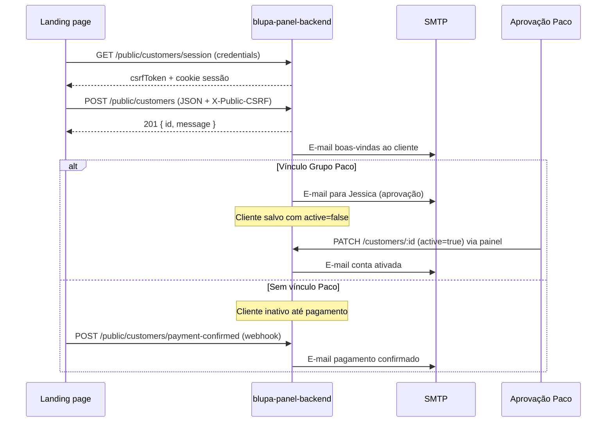

# Landing page — cadastro e vínculo Grupo Paco

Guia para integrar o formulário da **landing page** com o backend `blupa-panel-backend`, incluindo os novos campos de vínculo Grupo Paco, fluxo de ativação e chamadas HTTP.

Contrato OpenAPI: `docs/api-spec.yaml` (`PublicCreateCustomerRequest`, rotas `/public/customers/*`).

---

## Visão geral do fluxo



---

## Variáveis de ambiente (landing)

| Variável | Exemplo local | Uso |
|----------|---------------|-----|
| `VITE_API_URL` ou equivalente | `http://localhost:3000` | Base URL da API |
| Origem no backend | `LANDING_PAGE_ORIGIN=http://localhost:5173` | CORS — deve bater com a URL da landing |

Todas as chamadas abaixo usam **`credentials: 'include'`** para enviar o cookie de sessão.

---

## Passo 1 — Iniciar sessão (CSRF)

Antes de qualquer `POST`, a landing deve obter um token CSRF:

```http
GET /public/customers/session
```

**Fetch (TypeScript):**

```ts
const API_URL = import.meta.env.VITE_API_URL; // ex.: http://localhost:3000

export async function initLandingSession(): Promise<string> {
  const res = await fetch(`${API_URL}/public/customers/session`, {
    method: 'GET',
    credentials: 'include',
  });
  if (!res.ok) throw new Error('Falha ao iniciar sessão da landing');
  const data = (await res.json()) as { ok: true; csrfToken: string };
  return data.csrfToken;
}
```

O backend define o cookie `blupa.public.sid` (httpOnly). Guarde o `csrfToken` em memória (estado React, ref, etc.) — **não** em `localStorage`.

---

## Passo 2 — Modelo de dados do formulário

### Campos Grupo Paco

| Campo API | Tipo | Quando enviar | Persistência |
|-----------|------|---------------|--------------|
| `hasPacoGroupLink` | `boolean` | Sempre que o usuário marcar “Tenho vínculo Grupo Paco” | Não é coluna; deriva `paco_group_link` |
| `pacoGroupLink` | `'client' \| 'collaborator'` | Obrigatório se `hasPacoGroupLink === true` | `customers.paco_group_link` |
| `pacoClientId` | `string` (max 64) | **Obrigatório** se `pacoGroupLink === 'client'` | `customers.paco_client_id` |
| `cpf` | `string` | Sempre | `customers.cpf` — usado na validação externa para **colaborador** |

### Regras de negócio

| Tipo | Dados para validação externa Paco | Status após cadastro |
|------|-----------------------------------|----------------------|
| **Sem vínculo** | — | Inativo até confirmação de pagamento |
| **Cliente Paco** (`client`) | `pacoClientId` + CPF | Inativo até Jessica aprovar no painel |
| **Colaborador Paco** (`collaborator`) | Apenas `cpf` | Inativo até Jessica aprovar no painel |

A validação contra a API externa do Grupo Paco **não está no backend** neste MVP — o painel apenas **persiste** os identificadores para conferência manual / integração futura.

### Estado sugerido no React

```ts
type PacoLinkType = 'client' | 'collaborator' | '';

type LandingFormState = {
  // ... campos pessoais (name, email, cpf, password, etc.)
  hasPacoGroupLink: boolean;
  pacoGroupLink: PacoLinkType;
  pacoClientId: string;
};

function buildPacoPayload(form: LandingFormState) {
  if (!form.hasPacoGroupLink) {
    return {
      hasPacoGroupLink: false,
      pacoGroupLink: null,
      pacoClientId: null,
    };
  }

  if (form.pacoGroupLink !== 'client' && form.pacoGroupLink !== 'collaborator') {
    throw new Error('Selecione Cliente ou Colaborador Paco.');
  }

  if (form.pacoGroupLink === 'client' && !form.pacoClientId.trim()) {
    throw new Error('Informe o ID do cliente no Grupo Paco.');
  }

  return {
    hasPacoGroupLink: true,
    pacoGroupLink: form.pacoGroupLink,
    pacoClientId:
      form.pacoGroupLink === 'client' ? form.pacoClientId.trim() : null,
  };
}
```

---

## Passo 3 — UI do formulário (sugestão)

1. **Checkbox** — “Possuo vínculo com o Grupo Paco” → `hasPacoGroupLink`
2. Se marcado, exibir **radio** ou select:
   - Cliente Paco → `pacoGroupLink: 'client'`
   - Colaborador Paco → `pacoGroupLink: 'collaborator'`
3. Se **Cliente Paco**, exibir campo texto **ID do cliente Paco** → `pacoClientId`
4. Se **Colaborador**, não exibir `pacoClientId` (mensagem: “Usaremos seu CPF para validação.”)
5. Exibir aviso: cadastros Paco ficam **inativos** até aprovação; o cliente receberá e-mail.

---

## Passo 4 — Enviar cadastro

```http
POST /public/customers
Content-Type: application/json
X-Public-CSRF: <csrfToken da sessão>
Cookie: blupa.public.sid=... (automático com credentials)
```

**Exemplo — sem vínculo Paco:**

```json
{
  "name": "Maria Silva",
  "email": "maria@exemplo.com",
  "password": "SenhaSegura123",
  "cpf": "12345678909",
  "cellphone": "(11) 99999-9999",
  "birth_date": "01/01/1990",
  "hasPacoGroupLink": false
}
```

**Exemplo — cliente Paco:**

```json
{
  "name": "João Paco",
  "email": "joao@empresa.com",
  "password": "SenhaSegura123",
  "cpf": "98765432100",
  "cellphone": "(11) 98888-7777",
  "birth_date": "15/03/1985",
  "hasPacoGroupLink": true,
  "pacoGroupLink": "client",
  "pacoClientId": "PACO-12345"
}
```

**Exemplo — colaborador Paco:**

```json
{
  "name": "Ana Colaboradora",
  "email": "ana@empresa.com",
  "password": "SenhaSegura123",
  "cpf": "11122233344",
  "cellphone": "(11) 97777-6666",
  "birth_date": "20/06/1992",
  "hasPacoGroupLink": true,
  "pacoGroupLink": "collaborator"
}
```

**Fetch completo:**

```ts
export async function registerCustomer(
  csrfToken: string,
  body: Record<string, unknown>,
) {
  const res = await fetch(`${API_URL}/public/customers`, {
    method: 'POST',
    credentials: 'include',
    headers: {
      'Content-Type': 'application/json',
      'X-Public-CSRF': csrfToken,
    },
    body: JSON.stringify(body),
  });

  if (res.status === 409) {
    const msg = await res.text();
    throw new Error(msg || 'Cadastro já existe.');
  }
  if (!res.ok) {
    const err = await res.json().catch(() => ({}));
    throw new Error(
      (err as { message?: string }).message ?? 'Falha no cadastro.',
    );
  }

  return res.json() as Promise<{ id: string; message: string }>;
}
```

### Respostas

| HTTP | Significado |
|------|-------------|
| `201` | Sucesso — `{ "id": "<uuid>", "message": "Cadastro realizado com sucesso." }` |
| `400` | Validação (ex.: Paco client sem `pacoClientId`) |
| `401` / `403` | Sessão ou CSRF inválido — refaça `GET /session` |
| `409` | CPF já cadastrado |

---

## Passo 5 — Pagamento (sem vínculo Paco)

Após o gateway confirmar o pagamento, chame o webhook (server-to-server, **não** no browser):

```http
POST /public/customers/payment-confirmed
X-Payment-Webhook-Secret: <CUSTOMER_PAYMENT_WEBHOOK_SECRET>
Content-Type: application/json

{ "cpf": "12345678909" }
```

Isso ativa o cliente (`active: true`), autoriza na Blupa e envia e-mail de confirmação.

---

## Passo 6 — Fluxo na landing (pseudocódigo)

```ts
async function onSubmit(form: LandingFormState) {
  const csrf = await initLandingSession();
  const paco = buildPacoPayload(form);

  await registerCustomer(csrf, {
    name: form.name.trim(),
    email: form.email.trim().toLowerCase(),
    password: form.password,
    cpf: form.cpf.replace(/\D/g, ''),
    cellphone: form.cellphone,
    birth_date: form.birth_date,
    newsletter: form.newsletter,
    whatsapp: form.whatsapp,
    sms: form.sms,
    ...paco,
  });

  // Redirecionar para tela de sucesso / checkout conforme hasPacoGroupLink
}
```

---

## Migration no backend

Rode antes de testar em ambiente novo:

```bash
cd blupa-panel-backend
npm run migration:run
```

Colunas relevantes em `customers`:

| Coluna | Tipo | Descrição |
|--------|------|-----------|
| `paco_group_link` | `varchar(32)` nullable | `client` \| `collaborator` \| null |
| `paco_client_id` | `varchar(64)` nullable | ID externo Paco (só tipo `client`) |
| `active` | `boolean` | `false` para cadastros Paco e pré-pagamento |

---

## Checklist de implementação na landing

- [ ] `GET /public/customers/session` no mount ou antes do submit
- [ ] `credentials: 'include'` em todas as chamadas públicas
- [ ] Header `X-Public-CSRF` no POST
- [ ] Checkbox `hasPacoGroupLink` + tipo `pacoGroupLink`
- [ ] Campo `pacoClientId` condicional (só `client`)
- [ ] Validação client-side alinhada às regras acima
- [ ] Mensagens de sucesso distintas (Paco aguardando aprovação vs. aguardando pagamento)
- [ ] CORS: origem da landing em `LANDING_PAGE_ORIGIN` no backend
- [ ] Blupa + SMTP configurados no `.env` do backend para cadastro e e-mails

---

## Referências

- `docs/LOCAL-DEV.md` — ambiente local e login do painel
- `docs/api-spec.yaml` — schemas e rotas públicas
- `blupa-panel-backend/src/apis/customers/paco-group-link.ts` — normalização e regras de ativação
